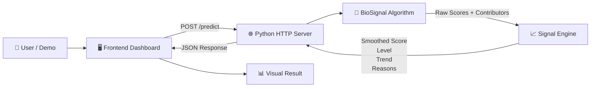
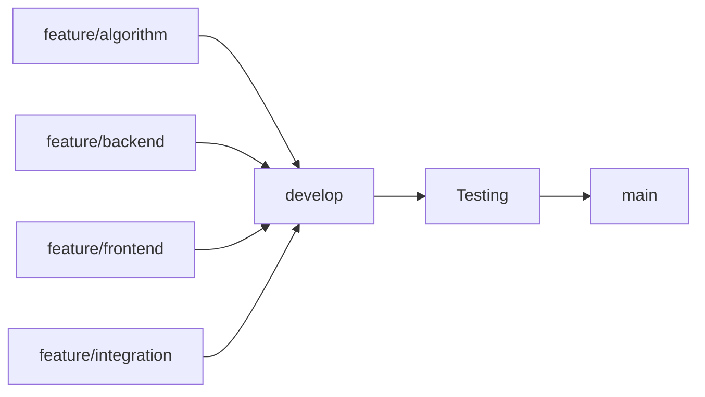

<div align="center">

# 🫀 BioSignal

### Turning physiological measurements into understandable signals.

**A lightweight physiological signal-analysis prototype that transforms repeated patient measurements into an explainable warning score, trend and visual timeline.**

<br>


<br>

[Overview](#-overview) •
[Features](#-features) •
[Architecture](#-architecture) •
[How it works](#-how-it-works) •
[Demo](#-demo-scenarios) •
[API](#-api) •
[Run](#-running-biosignal)

</div>

---

# ✨ Overview

**BioSignal** explores a simple idea:

> What if multiple physiological measurements could be transformed into one understandable signal showing both the current state and how it is changing over time?

Instead of displaying measurements independently, BioSignal combines:

* ❤️ **Heart Rate**
* 🌡️ **Body Temperature**
* 🧪 **White Blood Cell Count**
* 🩸 **Lactate**

into an explainable **BioSignal Warning Score**.

The system can analyze a single measurement or an entire timeline of measurements.

It then produces:

| Output                  | Purpose                                              |
| :---------------------- | :--------------------------------------------------- |
| **0–100 Warning Score** | Represents the current prototype signal intensity    |
| **Signal Level**        | `LOW` · `ELEVATED` · `STRONG`                        |
| **Trend**               | `RISING` · `STABLE` · `FALLING`                      |
| **Timeline**            | Shows how the signal develops over time              |
| **Contributors**        | Shows which measurements influence the score most    |
| **Explanation**         | Converts numerical changes into readable information |

> [!IMPORTANT]
> **BioSignal is a research prototype.**
> The displayed score is **not a diagnosis and not a clinically validated probability of sepsis or another medical condition.**

---

# 🚀 Features

<table>
<tr>
<td width="50%">

### 📊 Signal Analysis

* Animated **0–100 BioSignal score**
* `LOW / ELEVATED / STRONG`
* `RISING / STABLE / FALLING`
* Signal smoothing
* Weighted measurement scoring

</td>
<td width="50%">

### 📈 Timeline Analysis

* Add multiple measurements
* Timestamped measurement history
* SVG signal graph
* Previous-vs-current measurement changes
* Up to **50 measurements per analysis**

</td>
</tr>

<tr>
<td width="50%">

### 🧠 Explainability

* Human-readable explanations
* Measurement contribution bars
* Strongest current contributor
* **Most Important Change** detection
* Trend-aware interpretation

</td>
<td width="50%">

### 🖥️ Interactive Dashboard

* Live patient input
* Contextual warning banners
* Animated score transitions
* Reset / New Patient workflow
* Three built-in demo scenarios

</td>
</tr>
</table>

---

# 🖥️ Dashboard

The BioSignal interface is built as a single analysis dashboard.

```text
┌──────────────────────────────────────────────────────────────┐
│  BIOSIGNAL                                      PROTOTYPE    │
│  Physiological Early Signal Analysis                         │
├──────────────────────────────────────────────────────────────┤
│                                                              │
│                         72 / 100                             │
│                                                              │
│                      STRONG SIGNAL                           │
│                         ↑ RISING                             │
│                                                              │
│  HR 126 BPM     TEMP 39.2°C     WBC 16     LAC 4.5         │
│                                                              │
├──────────────────────────────────────────────────────────────┤
│  MOST IMPORTANT CHANGE                                      │
│  Lactate increased significantly across the timeline        │
├──────────────────────────────────────────────────────────────┤
│                                                              │
│  SIGNAL EVOLUTION                                           │
│                                                     ●        │
│                                              ●──────╯        │
│                                      ●───────╯               │
│                            ●─────────╯                       │
│                  ●─────────╯                                 │
│                                                              │
├─────────────────────────────┬────────────────────────────────┤
│ PATIENT DATA                │ WHY THIS SIGNAL?               │
│                             │                                │
│ Heart Rate      126         │ • Heart rate increased        │
│ Temperature     39.2        │ • Temperature increased       │
│ WBC             16          │ • Lactate increased           │
│ Lactate         4.5         │                                │
│                             │ CONTRIBUTORS                   │
│ + Add to Timeline           │ Lactate      █████████░       │
│ Analyze Signal              │ Heart Rate   ███████░░░       │
└─────────────────────────────┴────────────────────────────────┘
```

The actual interface automatically updates the score, graph, alert state, explanations and contributor bars when an analysis is performed.

---

# 🏗️ Architecture



### Data flow

```text
Patient Measurements
        │
        ▼
┌───────────────────┐
│ Input Validation  │
└─────────┬─────────┘
          ▼
┌───────────────────┐
│ BioSignal Scoring │
└─────────┬─────────┘
          ▼
┌───────────────────┐
│ Signal Smoothing  │
└─────────┬─────────┘
          ▼
┌───────────────────┐
│ Trend Detection   │
└─────────┬─────────┘
          ▼
┌───────────────────┐
│ Explanation       │
└─────────┬─────────┘
          ▼
       Dashboard
```

---

# 🧮 How It Works

## 1. Measurement scoring

Each physiological measurement is independently converted into a normalized contribution between:

```text
0.0 ────────────────────────────── 1.0
```

The algorithm uses piecewise interpolation rather than a binary threshold.

This means a measurement can progressively contribute more strongly as its value changes.

---

## 2. Weighted BioSignal score

The current prototype uses:

| Measurement     |  Weight |
| :-------------- | ------: |
| ❤️ Heart Rate   | **25%** |
| 🌡️ Temperature | **25%** |
| 🧪 WBC          | **20%** |
| 🩸 Lactate      | **30%** |

The raw score is calculated as:

```text
BioSignal =
    Heart Rate × 0.25
  + Temperature × 0.25
  + WBC × 0.20
  + Lactate × 0.30
```

The result is normalized between `0.0` and `1.0` and displayed as a score from:

```text
0 ─────────────────────────────────────────── 100
```

---

## 3. Signal smoothing

For measurement timelines, BioSignal reduces sudden jumps using:

```text
smoothed =
0.6 × current
+
0.4 × previous smoothed value
```

Example:

```text
RAW SIGNAL

12 ── 30 ── 55 ── 82


SMOOTHED SIGNAL

12 ── 23 ── 42 ── 66
```

This creates a clearer representation of signal evolution.

---

## 4. Signal classification

```text
0                    35                    65                 100
│────────────────────│─────────────────────│────────────────────│
        LOW                 ELEVATED              STRONG
```

| Smoothed score  | Level           |
| :-------------- | :-------------- |
| `< 0.35`        | 🟢 **LOW**      |
| `0.35 – < 0.65` | 🟠 **ELEVATED** |
| `≥ 0.65`        | 🔴 **STRONG**   |

---

## 5. Trend detection

BioSignal compares the beginning and end of the smoothed timeline.

| Signal Change | Result        |
| :------------ | :------------ |
| `≥ +0.08`     | ↑ **RISING**  |
| `≤ -0.08`     | ↓ **FALLING** |
| Otherwise     | → **STABLE**  |

Example:

```text
14 → 22 → 38 → 51 → 72
                      ↑
                    RISING
```

---

# 🧠 Explainable Signals

BioSignal is designed to show **why** a score changed.

Instead of returning only:

```text
72 / 100
```

the system can display explanations such as:

```text
Heart rate increased across the observed period.

Temperature increased across the observed period.

Lactate increased across the observed period.

Lactate is one of the strongest contributors
to the current signal.
```

The interface also displays the current contribution of each measurement.

```text
Lactate       █████████░  85%
Temperature   ███████░░░  70%
Heart Rate    ███████░░░  69%
WBC           ██████░░░░  57%
```

---

# 🕒 Measurement Timeline

Measurements can be added sequentially using:

```text
+ Add to Timeline
```

Example:

```text
14:10
HR 82 · 36.8°C · WBC 7.4 · Lactate 1.0

14:30
HR 94 · 37.5°C · WBC 9.5 · Lactate 1.5

14:50
HR 105 · 38.0°C · WBC 11.5 · Lactate 2.1

15:10
HR 126 · 39.2°C · WBC 16 · Lactate 4.5
```

The full history is then sent to the backend when:

```text
Analyze Signal
```

is pressed.

---

# 🧪 Demo Scenarios

BioSignal includes three demonstration patients.

<table>
<tr>
<td width="33%" align="center">

### 🟢 Stable Patient

Mostly normal measurements with little variation.

**Expected**

`LOW`

`→ STABLE`

</td>

<td width="33%" align="center">

### 🟠 Rising Signal

Measurements progressively worsen over time.

**Expected**

`LOW → ELEVATED → STRONG`

`↑ RISING`

</td>

<td width="33%" align="center">

### 🔴 Strong Signal

Already elevated measurements progress toward a high warning score.

**Expected**

`STRONG`

`↑ RISING`

</td>
</tr>
</table>

### Rising Signal example

```text
Heart Rate
82 → 94 → 105 → 116 → 126

Temperature
37.0 → 37.5 → 38.0 → 38.7 → 39.2

WBC
8.0 → 9.5 → 11.5 → 14.0 → 16.0

Lactate
1.1 → 1.5 → 2.1 → 3.0 → 4.5
```

---

# 🔌 API

## Health Check

```http
GET /health
```

Response:

```json
{
  "status": "ok",
  "service": "BioSignal"
}
```

---

## Analyze one measurement

```http
POST /predict
Content-Type: application/json
```

```json
{
  "hr": 116,
  "temperature": 38.8,
  "wbc": 15,
  "lactate": 3.1
}
```

---

## Analyze a timeline

```json
{
  "history": [
    {
      "hr": 82,
      "temperature": 37.0,
      "wbc": 8.0,
      "lactate": 1.1
    },
    {
      "hr": 105,
      "temperature": 38.0,
      "wbc": 11.5,
      "lactate": 2.1
    },
    {
      "hr": 126,
      "temperature": 39.2,
      "wbc": 16.0,
      "lactate": 4.5
    }
  ]
}
```

BioSignal currently supports up to **50 measurements per request**.

---

# 📁 Repository Structure

```text
HachatOwners/
│
├── backend/
│   ├── algorithm.py
│   ├── server
│   └── signal_engine
│
├── frontend/
│   ├── index.html
│   ├── style.css
│   └── app.js
│
├── assets/
│
├── docs/
│
├── tests/
│
└── README.md
```

| Component               | Responsibility                                     |
| :---------------------- | :------------------------------------------------- |
| `backend/algorithm.py`  | Physiological scoring and contributors             |
| `backend/server`        | HTTP server, static files and JSON API             |
| `backend/signal_engine` | Smoothing, classification, trends and explanations |
| `frontend/index.html`   | Dashboard structure                                |
| `frontend/style.css`    | Visual design and responsive layout                |
| `frontend/app.js`       | Timeline, API communication, animations and graph  |
| `assets/`               | Branding and visual assets                         |

---

# 🛠️ Technology Stack

<div align="center">

| Layer                 | Technology           |
| :-------------------- | :------------------- |
| **Backend**           | Python 3             |
| **HTTP Server**       | Python `http.server` |
| **API**               | JSON                 |
| **Frontend**          | HTML5                |
| **Styling**           | CSS3                 |
| **Logic**             | Vanilla JavaScript   |
| **Visualization**     | SVG                  |
| **Database**          | None                 |
| **External Packages** | None                 |

</div>

### Zero-install design

BioSignal intentionally avoids unnecessary frameworks.

```text
❌ Flask
❌ Django
❌ React
❌ Node.js
❌ npm
❌ Chart libraries
❌ Database

✅ Python
✅ HTML
✅ CSS
✅ JavaScript
✅ SVG
```

---

# ▶️ Running BioSignal

## Requirements

You only need:

* **Python 3**
* **A modern web browser**

No packages need to be installed.

---

### 1. Clone the repository

```bash
git clone https://github.com/laviniaichimm-blip/HachatOwners.git
```

```bash
cd HachatOwners
```

---

### 2. Start the server

```bash
python backend/server
```

On Windows you can also try:

```bash
py backend/server
```

---

### 3. Open BioSignal

Open:

```text
http://127.0.0.1:8000
```

in your browser.

---

### 4. Verify the backend

Open:

```text
http://127.0.0.1:8000/health
```

Expected result:

```json
{
  "status": "ok",
  "service": "BioSignal"
}
```

---

# 🌿 Development



| Branch                | Responsibility                    |
| :-------------------- | :-------------------------------- |
| `feature/algorithm`   | Physiological scoring             |
| `feature/backend`     | HTTP server and API               |
| `feature/frontend`    | Dashboard                         |
| `feature/integration` | Signal processing and integration |
| `develop`             | Combined development version      |
| `main`                | Stable version                    |

---

# ⚠️ Important Limitations

> [!CAUTION]
> BioSignal is an **educational and research prototype**.

BioSignal is **not**:

* a medical device;
* a diagnostic tool;
* a clinically validated early-warning system;
* a validated sepsis calculator;
* intended for real patient-care decisions;
* a replacement for medical professionals.

A result such as:

# `80 / 100`

means:

> **80/100 BioSignal Warning Score**

It does **not** mean:

> **80% probability of sepsis.**

The current scoring thresholds, interpolation curves, weights, smoothing parameters and trend rules are prototype engineering decisions.

Clinical use would require appropriate medical review, validation and regulatory consideration.

---

# 🔮 Future Development

Potential improvements include:

* clinically reviewed scoring methodology;
* validation against appropriate physiological datasets;
* additional physiological variables;
* real-time sensor input;
* longer patient timelines;
* configurable signal smoothing;
* advanced trend analysis;
* anomaly detection;
* automated tests;
* report export;
* improved accessibility;
* deployment packaging.

---

<div align="center">

<br>

# 🫀 BioSignal

### **From measurements to signals. From signals to understanding.**

<br>

`RESEARCH PROTOTYPE` • `EXPLAINABLE` • `LIGHTWEIGHT` • `ZERO-INSTALL`

<br>

**Not a medical diagnosis.**

</div>
