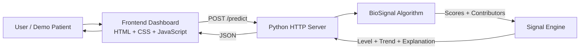

<h1 align="center">BioSignal</h1>

<p align="center">
  <strong>Turning physiological measurements into understandable early warning signals.</strong>
</p>

<p align="center">
  Physiological timeline analysis · explainable warning score · trend detection · interactive dashboard
</p>

<p align="center">
  
  
  
  
  
  
</p>

<p align="center">
  <a href="#about-biosignal">About</a> ·
  <a href="#features">Features</a> ·
  <a href="#system-architecture">Architecture</a> ·
  <a href="#algorithm">Algorithm</a> ·
  <a href="#api">API</a> ·
  <a href="#running-the-project">Run locally</a>
</p>

---

## About BioSignal

BioSignal is a lightweight physiological signal-analysis prototype that combines several measurements into a single, understandable warning signal.

Instead of showing measurements independently, BioSignal analyzes their combined pattern over time and produces:

| Output                      | Description                              |
| --------------------------- | ---------------------------------------- |
| **BioSignal Warning Score** | Normalized prototype score from 0 to 100 |
| **Signal Level**            | `LOW`, `ELEVATED` or `STRONG`            |
| **Trend**                   | `RISING`, `STABLE` or `FALLING`          |
| **Timeline**                | Smoothed evolution of the warning score  |
| **Explanations**            | Human-readable reasons behind the signal |
| **Contributors**            | Contribution of each current measurement |

The current prototype analyzes:

| Measurement          | Unit   |
| -------------------- | ------ |
| ❤️ Heart Rate        | BPM    |
| 🌡️ Temperature      | °C     |
| 🧪 White Blood Cells | 10⁹/L  |
| 🩸 Lactate           | mmol/L |

> **BioSignal is a research prototype and is not a medical diagnosis or clinically validated probability model.**

---

## Features

| Feature                          | Description                                         |
| -------------------------------- | --------------------------------------------------- |
| 📊 **0–100 Warning Score**       | Displays the current BioSignal score with animation |
| 🚦 **Signal Classification**     | LOW, ELEVATED or STRONG                             |
| 📈 **Trend Detection**           | RISING, STABLE or FALLING                           |
| 🕒 **Measurement Timeline**      | Add multiple measurements before analysis           |
| 🔔 **Alert System**              | Displays warnings for elevated and strong signals   |
| ↕️ **Measurement Changes**       | Shows changes between consecutive measurements      |
| 💡 **Most Important Change**     | Highlights the largest change in the timeline       |
| 📉 **Signal Graph**              | Displays smoothed warning-score evolution           |
| 🕐 **Timestamps**                | Timeline measurements include time information      |
| 🧠 **Explainable Results**       | Generates readable explanations                     |
| 📊 **Contributor Bars**          | Shows HR, temperature, WBC and lactate contribution |
| 🧪 **Demo Patients**             | Stable, Rising and Strong scenarios                 |
| 🔄 **New Patient Reset**         | Clears timeline and dashboard                       |
| ⚡ **Zero External Dependencies** | Runs with Python and browser-native technologies    |

---

## How It Works

```text
Physiological Measurements
          ↓
    Input Validation
          ↓
   BioSignal Algorithm
          ↓
     Raw Scores
          ↓
   Signal Smoothing
          ↓
 Level + Trend Detection
          ↓
Explanation + Contributors
          ↓
      JSON Response
          ↓
   Browser Dashboard
```

BioSignal can analyze either one measurement or a timeline containing several measurements.

Each measurement is scored individually before the resulting score history is smoothed and analyzed.

---

## System Architecture



Complete flow:

```text
Browser
   ↓
backend/server
   ↓
backend/algorithm.py
   ↓
backend/signal_engine
   ↓
backend/server
   ↓
frontend/app.js
   ↓
Dashboard
```

---

## Dashboard

The BioSignal frontend is a single-page dashboard built using plain HTML, CSS and JavaScript.

### Current BioSignal

The main dashboard displays:

* BioSignal Warning Score;
* signal level;
* detected trend;
* current physiological measurements;
* measurement changes relative to the previous point.

Example:

```text
CURRENT BIOSIGNAL

72 / 100

STRONG SIGNAL
↑ RISING

Heart Rate     126 BPM
Temperature    39.2°C
WBC            16
Lactate        4.5 mmol/L
```

---

### Alert System

LOW signals do not display an alert.

ELEVATED and STRONG states generate contextual warning banners.

If the signal is also rising, the alert reflects the detected trend.

---

### Measurement Timeline

Users can enter:

```text
Heart Rate
Temperature
White Blood Cells
Lactate
```

and press:

```text
+ Add to Timeline
```

Measurements are stored chronologically.

Example:

```text
14:10 HR 82 · 36.8°C · WBC 7.4 · Lac 1.0
14:30 HR 94 · 37.5°C · WBC 9.5 · Lac 1.5
14:50 HR 105 · 38.0°C · WBC 11.5 · Lac 2.1
```

Pressing:

```text
Analyze Signal
```

sends the complete timeline to the backend.

---

### Signal Evolution

The dashboard contains an SVG graph representing the BioSignal warning score over time.

```text
100 |
    |
 75 |                         ●
    |                    ●────╯
 50 |               ●────╯
    |          ●────╯
 25 |     ●────╯
    |
  0 +────────────────────────────
             Time →
```

No external charting library is required.

---

### Explanations

BioSignal generates human-readable explanations such as:

```text
Heart rate increased across the observed period.

Temperature increased across the observed period.

Lactate increased across the observed period.

Lactate is one of the strongest contributors to the current signal.
```

---

### Current Contributors

The dashboard shows the relative contribution of:

```text
Heart Rate
Temperature
WBC
Lactate
```

using visual progress bars.

---

## Demo Scenarios

### Stable Patient

Mostly normal values with little change.

```text
HR:       82 → 80 → 84 → 81
Temp:   36.8 → 36.9 → 37.0 → 36.9
WBC:     7.4 → 7.2 → 7.5 → 7.1
Lactate: 1.0 → 1.1 → 1.0 → 1.1
```

Expected result:

```text
LOW
STABLE
```

---

### Rising Signal

Measurements progressively worsen.

```text
82 → 94 → 105 → 116 → 126 BPM
```

The dashboard demonstrates:

```text
LOW
 ↓
ELEVATED
 ↓
STRONG
```

with:

```text
↑ RISING
```

---

### Strong Signal

The strong scenario progresses toward:

```text
Heart Rate:   132 BPM
Temperature:  39.5°C
WBC:          18
Lactate:      5.2 mmol/L
```

This demonstrates:

* strong warning state;
* alert banner;
* rising trend;
* measurement changes;
* contributor bars;
* signal graph;
* explanations.

---

## Algorithm

The core algorithm is located in:

```text
backend/algorithm.py
```

Each physiological variable is converted into a normalized contribution between:

```text
0.0 → 1.0
```

using piecewise interpolation.

### Current Weights

| Measurement | Weight |
| ----------- | -----: |
| Heart Rate  |    25% |
| Temperature |    25% |
| WBC         |    20% |
| Lactate     |    30% |

The raw score is calculated using:

```text
BioSignal =
    Heart Rate × 0.25
  + Temperature × 0.25
  + WBC × 0.20
  + Lactate × 0.30
```

The value is then converted to the 0–100 display scale.

---

## Signal Processing

The signal engine performs:

* score smoothing;
* signal classification;
* trend detection;
* measurement comparison;
* explanation generation.

### Smoothing

```text
smoothed =
0.6 × current
+
0.4 × previous smoothed value
```

This reduces sudden jumps in the graph.

---

### Signal Levels

| Score           | Level    |
| --------------- | -------- |
| `< 0.35`        | LOW      |
| `0.35 – < 0.65` | ELEVATED |
| `≥ 0.65`        | STRONG   |

---

### Trend Detection

| Change    | Trend   |
| --------- | ------- |
| `≥ +0.08` | RISING  |
| `≤ -0.08` | FALLING |
| Otherwise | STABLE  |

---

## API

### Health Check

```http
GET /health
```

Response:

```json
{
  "status": "ok",
  "service": "BioSignal"
}
```

---

### Analyze One Measurement

```http
POST /predict
Content-Type: application/json
```

```json
{
  "hr": 116,
  "temperature": 38.8,
  "wbc": 15,
  "lactate": 3.1
}
```

---

### Analyze a Timeline

```json
{
  "history": [
    {
      "hr": 82,
      "temperature": 37.0,
      "wbc": 8.0,
      "lactate": 1.1
    },
    {
      "hr": 105,
      "temperature": 38.0,
      "wbc": 11.5,
      "lactate": 2.1
    },
    {
      "hr": 126,
      "temperature": 39.2,
      "wbc": 16.0,
      "lactate": 4.5
    }
  ]
}
```

The server currently accepts a maximum of:

```text
50 measurements
```

per request.

---

## Repository Structure

```text
HachatOwners/
│
├── backend/
│   ├── algorithm.py
│   ├── server
│   └── signal_engine
│
├── frontend/
│   ├── index.html
│   ├── style.css
│   └── app.js
│
├── assets/
│
├── docs/
│
├── tests/
│
└── README.md
```

| File                    | Purpose                                                     |
| ----------------------- | ----------------------------------------------------------- |
| `backend/algorithm.py`  | Measurement scoring and contributor calculation             |
| `backend/server`        | HTTP server and API                                         |
| `backend/signal_engine` | Smoothing, classification, trend detection and explanations |
| `frontend/index.html`   | Dashboard structure                                         |
| `frontend/style.css`    | Dashboard styling                                           |
| `frontend/app.js`       | Timeline, demos, graph, API communication and animations    |
| `assets/`               | Branding and visual resources                               |

---

## Technology Stack

| Layer             | Technology           |
| ----------------- | -------------------- |
| Backend           | Python 3             |
| Web Server        | Python `http.server` |
| API Format        | JSON                 |
| Frontend          | HTML5                |
| Styling           | CSS3                 |
| Client Logic      | Vanilla JavaScript   |
| Visualization     | SVG                  |
| Database          | None                 |
| External Packages | None                 |

BioSignal intentionally avoids large frameworks.

No Flask.

No Django.

No React.

No Node.js.

No npm packages.

No external chart library.

---

## Running the Project

### Requirements

You need:

```text
Python 3
A modern web browser
```

No additional packages are required.

### Start the server

From the repository root:

```bash
python backend/server
```

Then open:

```text
http://127.0.0.1:8000
```

Health endpoint:

```text
http://127.0.0.1:8000/health
```

---

## Development Workflow

| Branch                | Responsibility                    |
| --------------------- | --------------------------------- |
| `feature/algorithm`   | Physiological scoring             |
| `feature/backend`     | HTTP server and API               |
| `feature/frontend`    | Dashboard                         |
| `feature/integration` | Signal processing and integration |
| `develop`             | Integrated development version    |
| `main`                | Stable version                    |

```text
feature/*
    ↓
 develop
    ↓
 testing
    ↓
   main
```

---

## Important Limitations

BioSignal is a **research and educational prototype**.

It is not:

* a medical device;
* a diagnostic tool;
* a clinically validated early-warning system;
* a validated sepsis probability calculator;
* intended for real patient-care decisions;
* a substitute for professional medical judgment.

A displayed score such as:

```text
80 / 100
```

means:

> **80/100 BioSignal Warning Score**

It does **not** mean:

> **80% probability of sepsis**

or an 80% probability of another medical condition.

The current thresholds, interpolation curves, weights, smoothing rules and trend rules are prototype engineering choices and require clinical validation before medical use.

---

## Future Development

Possible future improvements include:

* validation using physiological datasets;
* clinically reviewed scoring methodology;
* additional physiological measurements;
* real-time sensor input;
* longer timelines;
* anomaly detection;
* configurable smoothing;
* improved trend analysis;
* automated testing;
* exportable reports;
* accessibility improvements.

---

<div align="center">

## BioSignal

### From measurements to signals. From signals to understanding.

**Research prototype — not a medical diagnosis.**

</div>
