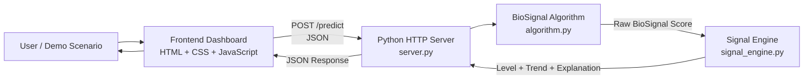
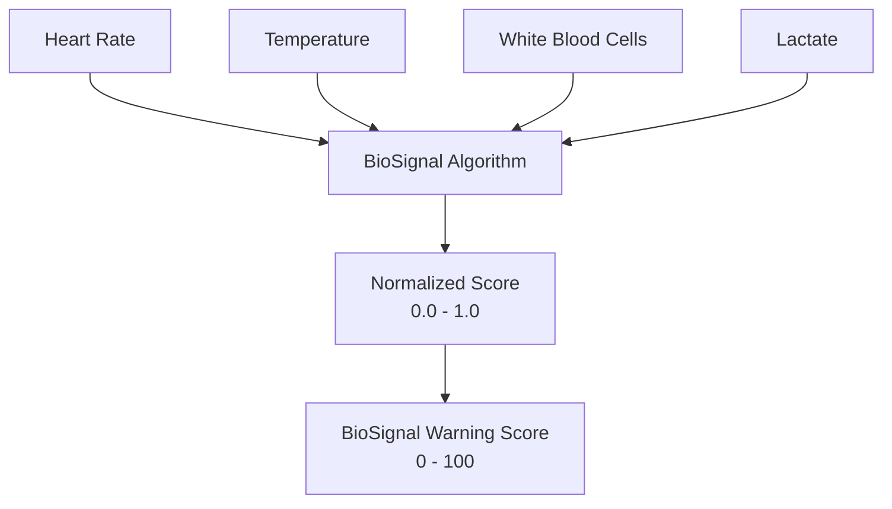

<div align="center">

# BioSignal

### Turning physiological measurements into understandable early warning signals.

**A lightweight physiological signal-analysis prototype that converts multiple patient measurements into a simple warning score, trend and human-readable explanation.**

Python backend · HTML/CSS/JavaScript frontend · Zero external dependencies

<br>


<br><br>

[About](#about-biosignal) ·
[How It Works](#how-it-works) ·
[Architecture](#system-architecture) ·
[Technology](#technology-stack) ·
[Run Locally](#running-the-project) ·
[Testing](#testing) ·
[Limitations](#important-limitations)

</div>

---

## About BioSignal

BioSignal is a lightweight physiological signal-analysis prototype designed to transform several medical measurements into a single, easy-to-understand warning signal.

Instead of displaying measurements independently, BioSignal combines them into a normalized **BioSignal Warning Score** and explains which measurements are contributing to the current signal.

The prototype currently works with four measurements:

| Measurement              | Description                            |
| ------------------------ | -------------------------------------- |
| ❤️ **Heart Rate**        | Patient heart rate in beats per minute |
| 🌡️ **Temperature**      | Body temperature in degrees Celsius    |
| 🧪 **White Blood Cells** | White blood cell measurement           |
| 🩸 **Lactate**           | Blood lactate measurement              |

The system converts these inputs into:

| Output            | Purpose                                                                  |
| ----------------- | ------------------------------------------------------------------------ |
| **Warning Score** | Normalized signal from 0 to 100                                          |
| **Signal Level**  | `LOW`, `ELEVATED` or `STRONG`                                            |
| **Trend**         | `RISING`, `STABLE` or `FALLING` when multiple measurements are available |
| **Explanation**   | Human-readable contributing factors                                      |

> **Status:** BioSignal is a hackathon research prototype and is not a medical diagnostic system.

---

## The Problem

Medical measurements are often viewed separately.

A heart rate may increase.

Temperature may rise.

Lactate may increase.

White blood cell measurements may change.

Individually, each value provides information. Together, however, the pattern may be more useful.

BioSignal explores a simple question:

> **Can several physiological measurements be transformed into one understandable signal that shows both severity and direction of change?**

The goal is not to replace medical interpretation.

The goal is to demonstrate how raw physiological measurements can be transformed into a clearer signal for visualization and further analysis.

---

## How It Works

BioSignal follows a simple processing pipeline:

```text
Physiological Measurements
          ↓
   Input Validation
          ↓
  BioSignal Algorithm
          ↓
   Normalized Score
          ↓
   Signal Processing
          ↓
Level + Trend + Explanation
          ↓
     JSON Response
          ↓
   Browser Dashboard
```

The algorithm analyzes:

```text
Heart Rate
Temperature
White Blood Cells
Lactate
```

and generates a normalized prototype score:

```text
0 ───────────────────────────────────── 100

LOW             ELEVATED             STRONG
```

The score is intentionally described as a **BioSignal Warning Score** rather than a probability of a medical condition.

---

## Main Features

| Feature                            | Description                                                       |
| ---------------------------------- | ----------------------------------------------------------------- |
| 📊 **BioSignal Score**             | Combines multiple measurements into a normalized warning score    |
| 🚦 **Signal Classification**       | Converts the score into LOW, ELEVATED or STRONG                   |
| 📈 **Trend Detection**             | Determines whether the signal is rising, stable or falling        |
| 💬 **Human-readable Explanations** | Shows which measurements contributed to the signal                |
| 🖥️ **Interactive Dashboard**      | Displays measurements and analysis directly in the browser        |
| 🧪 **Demo Scenarios**              | Allows rapid testing of stable, rising and strong signal examples |
| ⚡ **Zero-install Architecture**    | Uses only the Python standard library and browser technologies    |

---

## System Architecture

BioSignal is intentionally small and modular.



The complete request flow is:

```text
Browser
   │
   │ measurements
   ▼
server.py
   │
   ▼
algorithm.py
   │
   │ warning score
   ▼
signal_engine.py
   │
   │ level + trend + explanation
   ▼
server.py
   │
   │ JSON
   ▼
app.js
   │
   ▼
BioSignal Dashboard
```

---

## Repository Structure

| Path                       | Purpose                                                              |
| -------------------------- | -------------------------------------------------------------------- |
| `backend/algorithm.py`     | Converts physiological measurements into the BioSignal Warning Score |
| `backend/signal_engine.py` | Signal classification, smoothing, trend detection and explanations   |
| `backend/server.py`        | HTTP server and `/predict` API                                       |
| `frontend/index.html`      | Main BioSignal dashboard                                             |
| `frontend/style.css`       | Dashboard interface and responsive styling                           |
| `frontend/app.js`          | API communication, demo scenarios and visualization                  |
| `tests/`                   | Prototype validation and integration tests                           |
| `docs/`                    | Project documentation                                                |
| `assets/`                  | Images, screenshots and presentation resources                       |
| `README.md`                | Main project documentation                                           |

Repository layout:

```text
HachatOwners/
│
├── backend/
│   ├── algorithm.py
│   ├── signal_engine.py
│   └── server.py
│
├── frontend/
│   ├── index.html
│   ├── style.css
│   └── app.js
│
├── assets/
│
├── docs/
│
├── tests/
│
├── .gitignore
│
└── README.md
```

---

## Technology Stack

| Layer                 | Technology                     |
| --------------------- | ------------------------------ |
| Backend               | Python 3                       |
| HTTP Server           | Python `http.server`           |
| Data Format           | JSON                           |
| Frontend              | HTML5                          |
| Styling               | CSS3                           |
| Client Logic          | Vanilla JavaScript             |
| Visualization         | SVG / browser-native rendering |
| External Dependencies | None                           |

BioSignal intentionally avoids external frameworks and packages.

No Flask.

No Django.

No Node.js.

No npm packages.

No `pip install`.

The project can run using a normal Python 3 installation and a modern web browser.

---

## Backend

The backend acts as the connection between the user interface and the signal-processing system.

### `server.py`

Responsibilities:

* serves the frontend;
* receives physiological measurements;
* validates incoming JSON;
* calls the BioSignal algorithm;
* passes generated scores to the signal engine;
* returns the completed analysis to the frontend.

The primary API endpoint is:

```text
POST /predict
```

Example request:

```json
{
  "hr": 116,
  "temperature": 38.8,
  "wbc": 15.0,
  "lactate": 3.1
}
```

Example response structure:

```json
{
  "percentage": 70,
  "level": "STRONG",
  "trend": "RISING",
  "history": [
    0.18,
    0.27,
    0.39,
    0.55,
    0.70
  ],
  "reasons": [
    "Heart rate is elevated",
    "Body temperature is elevated",
    "White blood cell measurement is elevated",
    "Lactate measurement is elevated"
  ]
}
```

---

## BioSignal Algorithm

`backend/algorithm.py` contains the core scoring logic.

Each measurement contributes to the final signal:



The prototype algorithm uses predefined scoring rules.

It is designed to demonstrate signal aggregation rather than provide a clinically validated prediction.

---

## Signal Engine

`backend/signal_engine.py` converts numerical outputs into information that is easier to interpret.

It provides three main functions.

### Signal classification

```text
LOW
ELEVATED
STRONG
```

### Trend analysis

When multiple measurements are available:

```text
RISING
STABLE
FALLING
```

### Explanation generation

Instead of returning only numerical contributions, BioSignal generates readable explanations such as:

```text
Heart rate is elevated.

Body temperature is elevated.

Lactate is one of the strongest contributors to the current signal.
```

---

## Frontend Dashboard

The frontend is intentionally implemented as a single dashboard.

It allows the user to:

* enter physiological measurements;
* run a signal analysis;
* view the BioSignal Warning Score;
* view the current signal level;
* inspect the signal trend;
* understand the main contributing measurements;
* run predefined demonstration scenarios.

The interface is built entirely with:

```text
HTML
CSS
JavaScript
SVG
```

No frontend framework is required.

---

## Demo Scenarios

BioSignal includes three useful demonstration cases.

### Stable Patient

Example:

```text
Heart Rate:   75 BPM
Temperature:  36.8 °C
WBC:          7
Lactate:      1
```

Expected signal:

```text
LOW
```

### Rising Signal

Example values progressively increase over several measurements.

The dashboard should demonstrate:

```text
LOW
 ↓
ELEVATED
 ↓
STRONG
```

together with a rising signal graph.

### Strong Signal

Example:

```text
Heart Rate:   125 BPM
Temperature:  39.2 °C
WBC:          16
Lactate:      4.5
```

Expected signal:

```text
STRONG
```

These scenarios exist for demonstration and software testing only.

---

## Running the Project

### Requirements

You only need:

```text
Python 3
A modern web browser
```

No additional libraries need to be installed.

### Start BioSignal

From the project directory, run:

```bash
python backend/server.py
```

On Windows, if `python` is unavailable, try:

```bash
py backend/server.py
```

The server should display:

```text
BioSignal running
http://127.0.0.1:8000
```

Open:

```text
http://127.0.0.1:8000
```

in your browser.

---

## API

### Health Check

```http
GET /health
```

Example response:

```json
{
  "status": "ok"
}
```

### Analyze Signal

```http
POST /predict
```

Input:

```json
{
  "hr": 116,
  "temperature": 38.8,
  "wbc": 15,
  "lactate": 3.1
}
```

The backend processes the measurements and returns the calculated BioSignal analysis.

---

## Testing

The prototype should be validated against at least three categories.

| Test     |  HR | Temperature | WBC | Lactate | Expected |
| -------- | --: | ----------: | --: | ------: | -------- |
| Stable   |  75 |        36.8 |   7 |     1.0 | LOW      |
| Elevated | 105 |        38.2 |   9 |     1.5 | ELEVATED |
| Strong   | 125 |        39.2 |  16 |     4.5 | STRONG   |

The complete integration test verifies:

```text
Input
 ↓
Frontend
 ↓
Backend
 ↓
Algorithm
 ↓
Signal Engine
 ↓
Backend
 ↓
Frontend
 ↓
Displayed Result
```

---

## Development Workflow

Development is divided across four feature branches.

| Branch                | Responsibility                             |
| --------------------- | ------------------------------------------ |
| `feature/algorithm`   | Physiological scoring algorithm            |
| `feature/backend`     | HTTP server and API                        |
| `feature/frontend`    | Dashboard and visualization                |
| `feature/integration` | Signal processing, testing and integration |
| `develop`             | Combined development version               |
| `main`                | Stable version                             |

The intended workflow is:

```text
feature/*
    ↓
 develop
    ↓
 testing
    ↓
   main
```

---

## Design Goals

BioSignal was built around four principles:

### Simple

The system should be understandable by both developers and users.

### Explainable

The application should show why the warning signal changes rather than displaying only a score.

### Lightweight

The project should run without large frameworks or external dependencies.

### Visual

Changes in physiological measurements should be visible as a changing signal rather than isolated numbers.

---

## Important Limitations

BioSignal is a **research and educational prototype**.

It is **not**:

* a medical device;
* a diagnostic tool;
* a clinically validated risk calculator;
* a substitute for professional medical judgment;
* intended for real patient-care decisions.

The BioSignal Warning Score represents the output of a prototype signal-processing algorithm.

For this reason, a score such as:

```text
80 / 100
```

means:

> **80/100 BioSignal Warning Score**

and does **not** mean:

> 80% probability of sepsis or any other medical condition.

---

## Future Development

Possible future improvements include:

* larger physiological datasets;
* validated statistical or machine-learning models;
* real-time sensor input;
* longer signal histories;
* improved temporal analysis;
* adaptive thresholds;
* additional physiological measurements;
* anomaly detection;
* exportable patient reports;
* improved visualization;
* clinically reviewed validation methodology.

---

## Team

BioSignal was developed as a four-person collaborative hackathon project.

The work was divided into:

```text
Algorithm
Backend
Frontend
Signal Processing & Integration
```

with all components combined into one working signal-analysis pipeline.

---

<div align="center">

## BioSignal

**From measurements to signals. From signals to understanding.**

Research prototype — not a medical diagnosis.

</div>

